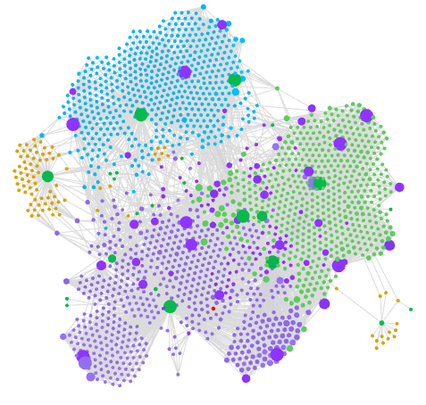

<figure style="float: right; margin: -10px 0 0 20px;">
  
  <figcaption style="text-align:center;">My Obsidian Graph 2026-09-01</figcaption>
</figure>

Welcome to my blog! I am Kevin Xu, currently a 2nd year Software Engineering student at the [[University of Waterloo]].  
The reason I enrolled in this program is because software drives many technologies and there are endless possibilities on what to build.
 
In my spare time, I like to read [[Book]]s, watch [[Film]]s, be active, and vibe code my b2b saas ai stealth startups.
 
I have been taking notes ever since middle school; from pen and paper to [Notion](https://www.notion.com/) to now [Obsidian](https://obsidian.md/), I've amassed a "wealth" of knowledge, some of which I'd like to share here.  
I take notes for organization purposes, so I can keep up with what I've learned and what there is to learn. Maintaining a knowledge base can be quite the hassle, so I believe in simple organization workflows that reduces friction when note-taking (in other words, I use my vibe coding AI b2b saas stealth agent to mcp into the earth and take notes for me).

Check out my writing topics:  
[[Film]]
 
[[Book]]
 
[[Journal]]
 
[[Thoughts]]
 
[[Experience]]
 
[[Food]]
 
[[Music]]
 
[[Competitive Programming]]
 
[[Math]]

<!--LANG:zh-->

欢迎来到我的博客！
 
浏览我的写作主题：
 
[[Film|影视]]
 
[[Book|书籍]]
 
[[Journal|日记]]
 
[[Thoughts|感想]]
 
[[Experience|经历]]
 
[[Food|美食]]
 
[[Music|音乐]]
 
[[Competitive Programming|算法竞赛]]
 
[[Math|数学]]
